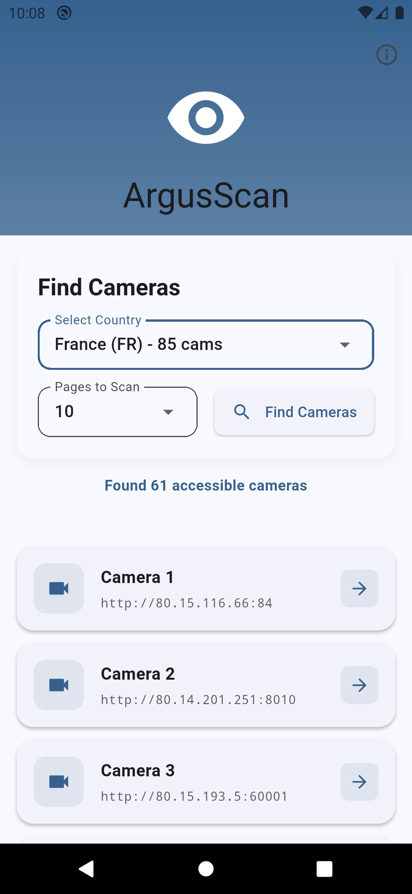
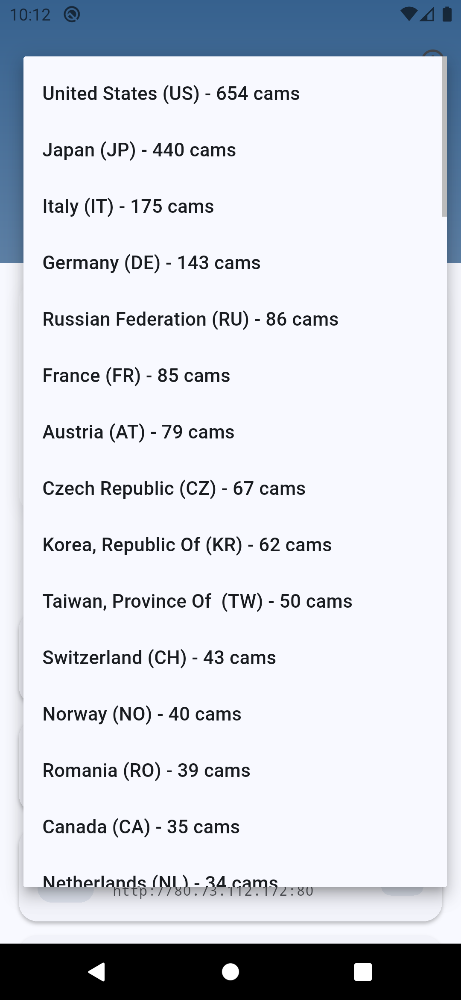
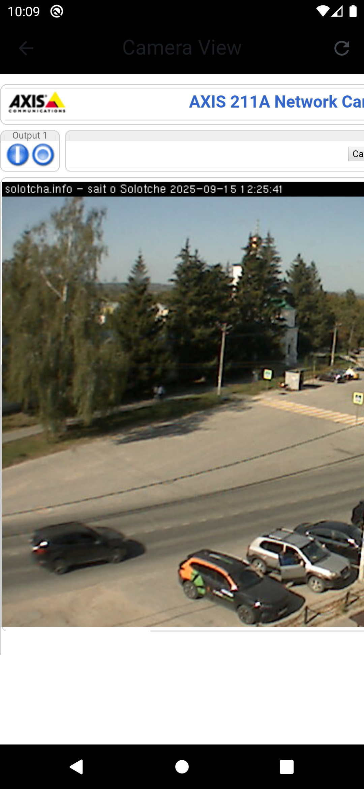
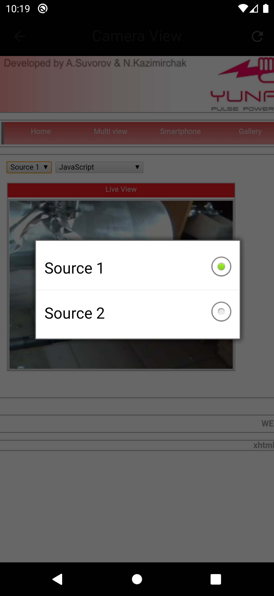
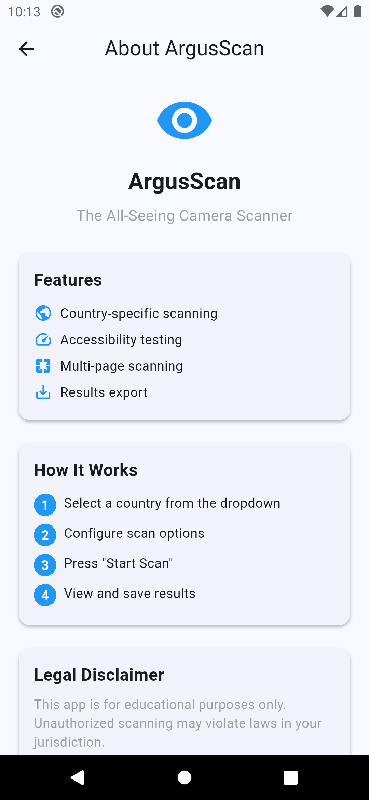

# ArgusScan App

A Flutter application for scanning and viewing camera feeds from various sources. This app allows users to discover and access camera feeds from different locations and countries.

## Screenshots

<div align="center">
  
  
  
  
  
</div>

## Features

- 🌍 **Country-based Camera Discovery**: Browse cameras by country
- 📱 **Cross-platform Support**: Works on Android, iOS, Web, Windows, macOS, and Linux
- 🔍 **Camera Scanning**: Automatically scan and discover accessible cameras
- 📺 **Live Camera Viewing**: View camera feeds directly in the app
- 💾 **Export Functionality**: Save and share discovered camera URLs
- 🎨 **Modern UI**: Clean and intuitive user interface
- 🔒 **Secure Access**: Proper network security configuration

## Prerequisites


## Installation

1. **Clone the repository**
   ```bash
   git clone https://github.com/roxm337/argus_scan_app.git
   cd argus_scan_app
   ```

2. **Install dependencies**
   ```bash
   flutter pub get
   ```

3. **Run the app**
   ```bash
   flutter run
   ```

## Building for Different Platforms

### Android
```bash
flutter build apk --release
```

### iOS
```bash
flutter build ios --release
```

### Web
```bash
flutter build web --release
```

### Windows
```bash
flutter build windows --release
```

### macOS
```bash
flutter build macos --release
```

### Linux
```bash
flutter build linux --release
```

## Dependencies

This project uses the following key dependencies:

- **flutter**: The Flutter framework
- **http**: ^1.1.0 - For HTTP requests
- **dio**: ^5.4.0 - Advanced HTTP client
- **webview_flutter**: ^4.9.0 - WebView integration
- **path_provider**: ^2.1.1 - File system access
- **share_plus**: ^7.2.1 - File sharing functionality
- **flutter_markdown**: ^0.6.18 - Markdown rendering

## Project Structure

```
lib/
├── main.dart                 # App entry point
├── models/                   # Data models
│   └── camera.dart
├── screens/                  # UI screens
│   ├── home_screen.dart
│   ├── camera_viewer_screen.dart
│   └── info_screen.dart
├── services/                 # Business logic
│   └── camera_service.dart
├── theme/                    # App theming
│   └── app_theme.dart
└── widgets/                  # Reusable widgets
    ├── loading_overlay.dart
    └── primary_button.dart
```

## Usage

1. **Launch the app** and you'll see the home screen
2. **Select a country** from the dropdown to scan for cameras
3. **Tap "Scan Cameras"** to discover available camera feeds
4. **View results** in the list of discovered cameras
5. **Tap on a camera** to view the live feed
6. **Export results** by tapping the save button to share camera URLs

## Configuration

### Android Network Security
The app includes a network security configuration that allows HTTP traffic for camera feeds. This is configured in:
- `android/app/src/main/res/xml/network_security_config.xml`
- `android/app/src/main/AndroidManifest.xml`

### Permissions
The app requires the following permissions:
- `INTERNET` - For network access
- `ACCESS_NETWORK_STATE` - For network status checking
- `ACCESS_MEDIA_LOCATION` - For media access

## Contributing

1. Fork the repository
2. Create a feature branch (`git checkout -b feature/amazing-feature`)
3. Commit your changes (`git commit -m 'Add some amazing feature'`)
4. Push to the branch (`git push origin feature/amazing-feature`)
5. Open a Pull Request

## Development

### Running Tests
```bash
flutter test
```

### Code Analysis
```bash
flutter analyze
```

### Formatting Code
```bash
flutter format .
```

## Troubleshooting

### Common Issues

1. **Build fails on Android**
   - Ensure you have the latest Android SDK
   - Check that all dependencies are properly installed

2. **WebView not loading camera feeds**
   - Verify network security configuration is properly set
   - Check that the camera URLs are accessible

3. **iOS build issues**
   - Ensure Xcode is up to date
   - Check iOS deployment target compatibility


**Note**: This app is for educational and research purposes. Please ensure you have proper authorization before accessing any camera feeds and respect privacy laws and regulations in your jurisdiction.
